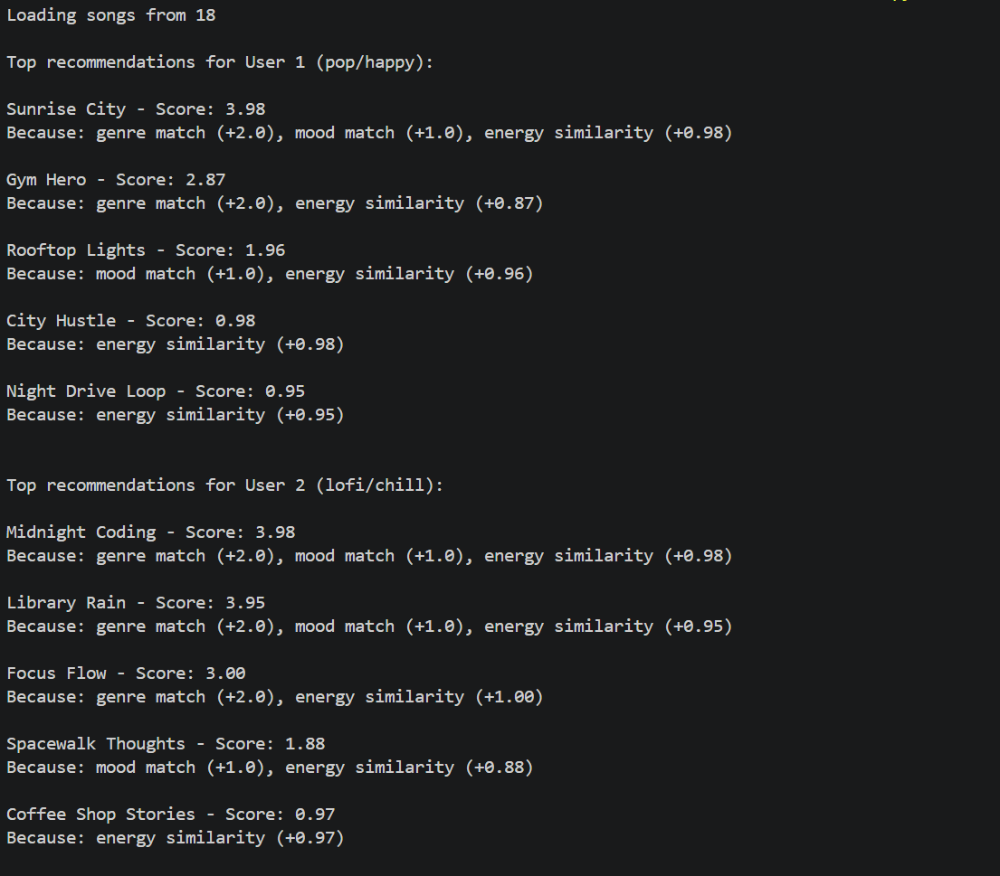

# 🎵 Music Recommender Simulation

## Personal Reflection

This project helped me understand how recommendation systems turn simple data into predictions. By assigning weights to features like genre, mood, and energy, I saw how a system can rank songs in a way that feels personalized even though it is based on basic math.

One thing that stood out to me was how small changes in the scoring logic can significantly affect the results. For example, increasing the weight of genre caused the system to repeatedly recommend the same type of songs, while adjusting energy made the recommendations more varied. This showed me how easily bias can be introduced into a system depending on how features are prioritized.

Using AI tools like Copilot helped speed up the coding process and gave me ideas for structuring functions, but I still had to carefully review and understand the logic to make sure it matched my intended design. It was especially important when debugging or adjusting the scoring system.

What surprised me most is how even a simple recommender can feel accurate, but still miss important aspects of human taste. Real music preferences are more complex than just genre or mood, which made me realize why real-world systems are much more advanced.

If I continued this project, I would focus on improving recommendation diversity and allowing the system to recognize similar genres instead of only exact matches. I would also explore adding more user data like listening history to make the recommendations feel more realistic.

- The system struggles with conflicting preferences high energy and sad mood  
- It only matches exact genres and moods, not similar ones  
- The small dataset leads to repeated recommendations  

### DEMO SCREENSHOT:




## Project Summary

In this project you will build and explain a small music recommender system.

Your goal is to:

- Represent songs and a user "taste profile" as data
- Design a scoring rule that turns that data into recommendations
- Evaluate what your system gets right and wrong
- Reflect on how this mirrors real world AI recommenders

Replace this paragraph with your own summary of what your version does.

---

## How The System Works

Explain your design in plain language.

Some prompts to answer:

- What features does each `Song` use in your system
  - For example: genre, mood, energy, tempo
- What information does your `UserProfile` store
- How does your `Recommender` compute a score for each song
- How do you choose which songs to recommend

You can include a simple diagram or bullet list if helpful.

My system will work by matching songs to a users personal taste using a few key features. Each Song includes attributes like genre, mood, energy, and tempo, which together describe the songs overall vibe. The UserProfile stores the listeners preferred genre, mood, energy level, and tempo, acting as a target for what they enjoy. To recommend music, the system compares each song to the user’s preferences and assigns it a score: songs get more points if the genre and mood match exactly, and additional points if their energy and tempo are close to the user’s preferred values. This means songs that feel more similar to the user’s taste receive higher scores. After scoring all songs, the system sorts them from highest to lowest score and recommends the top matches.

### Phase 2: Scoring Logic Overview

I analyzed how the recommender calculates song scores to understand which songs will be suggested first.

**Scoring formula:**

- Genre match: +2.0 points  
- Mood match: +1.5 points  
- Acoustic preference match: +0.5 points  

**Example calculation:**

For a user who likes pop, happy, energy 0.75, and dislikes acoustic songs:

- *Sunrise City* matches genre and mood, has similar energy, and is not acoustic → total score ≈ 5.86  
- *Night Drive Loop* does not match genre or mood, but energy is perfect and not acoustic → total score ≈ 2.5  

**Observations:**

- Songs that match both genre and mood will usually rank first.  
- Energy similarity helps break ties between similar songs.  
- Acoustic preference is only a small factor.  
- Genre dominates the scoring, so songs in other genres rarely reach the top even if they match mood and energy well.

* Used the help of co-pilot
---

## Getting Started

### Setup

1. Create a virtual environment (optional but recommended):

   ```bash
   python -m venv .venv
   source .venv/bin/activate      # Mac or Linux
   .venv\Scripts\activate         # Windows

2. Install dependencies

```bash
pip install -r requirements.txt
```

3. Run the app:

```bash
python -m src.main
```

### Running Tests

Run the starter tests with:

```bash
pytest
```

You can add more tests in `tests/test_recommender.py`.

---

## Experiments You Tried

Use this section to document the experiments you ran. For example:

- What happened when you changed the weight on genre from 2.0 to 0.5
- What happened when you added tempo or valence to the score
- How did your system behave for different types of users

---

## Limitations and Risks

Summarize some limitations of your recommender.

Examples:

- It only works on a tiny catalog
- It does not understand lyrics or language
- It might over favor one genre or mood

You will go deeper on this in your model card.

---

## Reflection

Read and complete `model_card.md`:

[**Model Card**](model_card.md)

Write 1 to 2 paragraphs here about what you learned:

- about how recommenders turn data into predictions
- about where bias or unfairness could show up in systems like this


---

## 7. `model_card_template.md`

Combines reflection and model card framing from the Module 3 guidance. :contentReference[oaicite:2]{index=2}  

```markdown
# 🎧 Model Card - Music Recommender Simulation

## 1. Model Name

Give your recommender a name, for example:

> VibeFinder 1.0

---

## 2. Intended Use

- What is this system trying to do
- Who is it for

Example:

> This model suggests 3 to 5 songs from a small catalog based on a user's preferred genre, mood, and energy level. It is for classroom exploration only, not for real users.

---

## 3. How It Works (Short Explanation)

Describe your scoring logic in plain language.

- What features of each song does it consider
- What information about the user does it use
- How does it turn those into a number

Try to avoid code in this section, treat it like an explanation to a non programmer.

---

## 4. Data

Describe your dataset.

- How many songs are in `data/songs.csv`
- Did you add or remove any songs
- What kinds of genres or moods are represented
- Whose taste does this data mostly reflect

---

## 5. Strengths

Where does your recommender work well

You can think about:
- Situations where the top results "felt right"
- Particular user profiles it served well
- Simplicity or transparency benefits

---

## 6. Limitations and Bias

Where does your recommender struggle

Some prompts:
- Does it ignore some genres or moods
- Does it treat all users as if they have the same taste shape
- Is it biased toward high energy or one genre by default
- How could this be unfair if used in a real product

Songs only score points if the genre and mood exactly match the user’s preferences.

All users are treated the same. The formula (+2 genre, +1 mood, energy similarity) assumes everyone values genre over energy, which may not reflect real tastes.

Popular genres like pop or lofi often dominate the top recommendations. Songs with higher energy tend to get higher scores, giving them an advantage even if the user prefers lower energy.
---

## 7. Evaluation

How did you check your system

Examples:
- You tried multiple user profiles and wrote down whether the results matched your expectations
- You compared your simulation to what a real app like Spotify or YouTube tends to recommend
- You wrote tests for your scoring logic

You do not need a numeric metric, but if you used one, explain what it measures.

---

## 8. Future Work

If you had more time, how would you improve this recommender

Examples:

- Add support for multiple users and "group vibe" recommendations
- Balance diversity of songs instead of always picking the closest match
- Use more features, like tempo ranges or lyric themes

---

## 9. Personal Reflection

A few sentences about what you learned:

- What surprised you about how your system behaved
- How did building this change how you think about real music recommenders
- Where do you think human judgment still matters, even if the model seems "smart"

## 10. Demo of Profile Recommendation!

**Copied/Pasted Terminal Output**

Top recommendations for User 1 (pop/happy):

Sunrise City - Score: 3.98
Because: genre match (+2.0), mood match (+1.0), energy similarity (+0.98)

Gym Hero - Score: 2.87
Because: genre match (+2.0), energy similarity (+0.87)

Rooftop Lights - Score: 1.96
Because: mood match (+1.0), energy similarity (+0.96)

City Hustle - Score: 0.98
Because: energy similarity (+0.98)

Night Drive Loop - Score: 0.95
Because: energy similarity (+0.95)


Top recommendations for User 2 (lofi/chill):

Midnight Coding - Score: 3.98
Because: genre match (+2.0), mood match (+1.0), energy similarity (+0.98)

Library Rain - Score: 3.95
Because: genre match (+2.0), mood match (+1.0), energy similarity (+0.95)

Focus Flow - Score: 3.00
Because: genre match (+2.0), energy similarity (+1.00)

Spacewalk Thoughts - Score: 1.88
Because: mood match (+1.0), energy similarity (+0.88)

Coffee Shop Stories - Score: 0.97
Because: energy similarity (+0.97)

Why did the songs rank #1: They maximized all scoring criteria genre match, mood match, and closest energy value. Any deviation in one of these factors (wrong genre, mood, or energy further from target) results in a lower score.